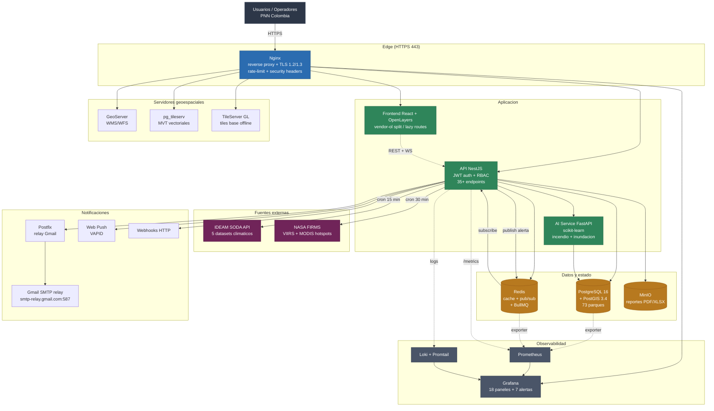
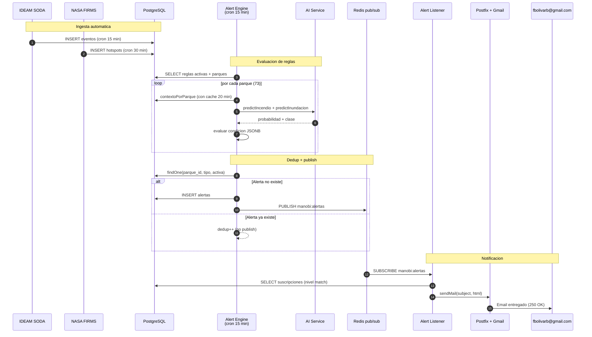

# Arquitectura — Manobi Sentinel

## Diagrama de arquitectura (Mermaid)

> GitHub renderiza este bloque como un diagrama interactivo.
> Para exportarlo como PNG: copia el bloque en https://mermaid.live y descarga.



## Vista general (ASCII fallback)

```
                         +------------------------+
                         |  Usuarios / Operadores |
                         +----------+-------------+
                                    | HTTPS 443
                                    v
                              +---------+
                              |  Nginx  |  reverse proxy + SSL + rate limit + headers
                              +----+----+
          +----------+-------------+--------------+------------+-----------+
          v          v             v              v            v           v
      Frontend   API (NestJS)  GeoServer   pg_tileserv   TileServer GL  Grafana
       (React)        |        (WMS/WFS)    (MVT)        (tiles base)
                      |
         +------------+---------------------+
         v            v                     v
      PostgreSQL   Redis                MinIO        AI Service (FastAPI)
      + PostGIS    (cache + queue)      (S3)         scikit-learn
```

## Redes Docker

- **frontend-net** — nginx ↔ frontend
- **backend-net** — api, postgres, redis, minio, ai-service, geo-services, postfix
- **monitoring-net** — prometheus, grafana, loki, promtail

## Decisiones clave

| Tema            | Elección                    | Motivo                                               |
|-----------------|-----------------------------|------------------------------------------------------|
| Mapa frontend   | OpenLayers + tiles locales  | Sin API keys externas, cumple requisito on-premise   |
| Base de datos   | PostgreSQL 16 + PostGIS 3.4 | Estándar GIS, soporte JSONB para reglas dinámicas    |
| Colas           | BullMQ sobre Redis          | Misma infra que cache, menos servicios               |
| Observabilidad  | Prometheus + Grafana + Loki | Stack abierto, sin licencias                         |
| SSL             | Nginx con TLS 1.2/1.3       | Obligatorio por requerimiento gubernamental          |
| IA              | scikit-learn + árbol decisión | Interpretabilidad exigida por entidad              |
| Reportes PDF    | Puppeteer + Chromium headless | HTML→PDF fiel, misma plantilla que el frontend     |

## Flujo de alerta (Mermaid)



## Flujo de alerta (ASCII fallback)

```
IDEAM / sensores --> eventos_climaticos (Postgres)
                        |
                        v
              Alert Engine (@Cron 15 min)
                        |
          +-------------+-------------+
          v             v             v
     Regla JSONB   Prediccion IA  Deduplicacion
                        |
                        v
                    alertas (Postgres)
                        |
          +-------------+-------------+
          v             v             v
       WebSocket    BullMQ email   Webhook
       (frontend)   (Postfix)      (http post)
```
